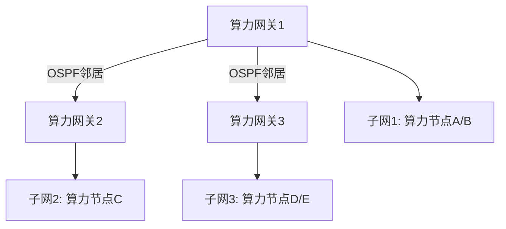
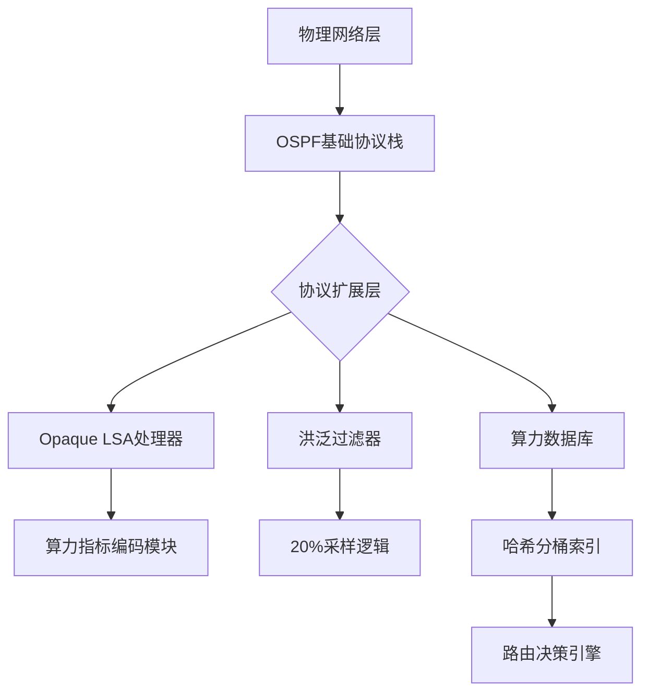

### deepseek1

##### Deepseek 1

以下是针对你的算力路由项目的详细实现建议和问题解答：

---

### **核心实现框架**

#### **1. 协议层扩展设计**

```python
class ComputeLSA(OSPF_LSA):
    TYPE = 11                # 使用Opaque LSA Type 11（本地链路范围）
    def __init__(self, node_id, compute_type, capacity):
        self.header = {
            "ls_age": 0,
            "ls_type": 11,
            "node_id": node_id,
            "seq": 0x80000001,
            "payload": {
                "compute_type": compute_type,  # 如GPU/CPU类型
                "capacity": capacity,          # 算力值（如TFLOPS）
                "hash_bucket": self._gen_hash(capacity) # 哈希分桶结果
            }
        }
```

#### **2. 网络拓扑模拟架构**



---

### **关键模块实现思路**

#### **1. 选择性洪泛控制**

```python
def flood_filter(lsa_list):
    """实现20%的LSA选择转发"""
    import random
    selected = random.sample(lsa_list, max(1, len(lsa_list)//5)) 
    return selected

class Gateway:
    def receive_lsa(self, lsa):
        # 记录原始LSA
        self.raw_db.append(lsa)
        # 筛选20%进行洪泛
        selected = flood_filter(lsa_list) 
        self.forward_lsa(selected)
```

#### **2. 算力路由表构建**

```python
class ComputeRouteTable:
    def __init__(self):
        self.hash_map = defaultdict(list)  # {compute_type: [nodes]}
        
    def update(self, lsa_list):
        for lsa in lsa_list:
            c_type = lsa.payload["compute_type"]
            self.hash_map[c_type].append({
                "node_ip": lsa.node_id,
                "hash_val": lsa.payload["hash_bucket"]
            })
            
    def get_target(self, req_type):
        # 一致性哈希查找
        candidates = self.hash_map[req_type]
        target = consistent_hash(req_type, candidates)
        return target["node_ip"]
```

---

### **问题解答**

#### **1. 算力节点主动洪泛的实现方法**

- **可行方案**：
  - **代理洪泛**：在算力节点所在子网的网关实现 LSA 生成
  ```python
  class Gateway:
      def poll_compute_nodes(self):
          # 定期轮询子网内的算力节点
          for node in self.subnet.nodes:
              if node.capacity_updated:
                  lsa = ComputeLSA(node.ip, node.type, node.capacity)
                  self.link_state_db.add(lsa)
  ```
  - **直接扩展**：修改 OSPF 协议栈允许终端发 LSA（需实现轻量级 OSPF 实例）

- **技术挑战**：
  - 需要确保节点 ID 在 OSPF 域内唯一
  - 需处理终端设备的资源限制（CPU/内存）

#### **2. 流程完整性评估**

| 步骤 | 完整性检查点 | 改进建议 |
|------|--------------|----------|
| 邻居建立 | 确保 DR/BDR 选举机制正常 | 增加多区域场景验证 |
| 算力 LSA 洪泛 | 验证 Opaque LSA 的跨网段传播 | 添加 TTL 检查机制 |
| 选择性洪泛 | 确认 20%过滤的统计学分布 | 加入熵值检测工具 |
| 哈希路由 | 测试哈希分布均匀性 | 实现虚拟节点优化 |

#### **3. 可行性验证重点**

- **核心验证指标**：
  ```python
  validation_metrics = {
      "lsa_convergence_time": 0.0,    # 全网算力信息同步耗时
      "hash_hit_rate": 0.0,           # 请求与算力节点匹配率
      "selective_flood_ratio": 0.2,   # 实际洪泛比例
      "route_loop_detection": False   # 确保无环路产生
  }
  ```
- **后续步骤**：
  1. **性能基准测试**：对比传统 OSPF 与算力路由的开销差异
  2. **异常场景测试**：
     - 算力节点动态加入/离开
     - 网关节点故障恢复
  3. **协议标准化**：起草 IETF 草案描述扩展机制

---

### **创新点实现建议**

#### **动态洪泛比例调整**

```python
def adaptive_flood_ratio(current_load):
    """根据网络负载动态调整洪泛比例"""
    if current_load < 0.3:
        return 0.5  # 低负载时多传播信息
    elif current_load > 0.7:
        return 0.1  # 高负载时减少洪泛
    else:
        return 0.2
```

#### **跨层哈希优化**

```python
def topology_aware_hash(node_list):
    """基于网络位置的哈希优化"""
    sorted_nodes = sorted(node_list, key=lambda x: x['latency'])
    virtual_nodes = []
    for node in sorted_nodes:
        weight = node['capacity'] / 100  # 假设基准容量为100
        virtual_nodes.extend([node]*int(weight))
    return virtual_nodes
```

---

### **推荐实现工具栈**

| 组件   | 推荐工具                | 优势说明          |
| ---- | ------------------- | ------------- |
| 网络模拟 | Mininet + FRRouting | 支持自定义 LSA 注入  |
| 协议开发 | Quagga OSPFd 源码修改   | 成熟的 OSPF 实现基础 |
| 数据平面 | P4 交换机              | 实现哈希分桶硬件加速    |
| 可视化  | GNS3 + ELK Stack    | 实时展示算力分布      |

---

### **典型验证场景设计**

```python
test_scenario = {
    "topology": "3网关全连接+各带2子网",
    "events": [
        {"t": 0,   "action": "启动所有网关"},
        {"t": 30,  "action": "子网1新增算力节点"},
        {"t": 60,  "action": "切断网关2-网关3链路"},
        {"t": 90,  "action": "模拟1000次请求路由"}
    ],
    "metrics": [
        "全网算力信息收敛时间",
        "故障场景下的路由恢复时间",
        "请求分配标准差（负载均衡度）"
    ]
}
```

通过以上架构设计，既可保持与传统 OSPF 网络的兼容性，又能实现算力感知路由的创新功能。建议先在小规模模拟环境中验证核心机制，再逐步扩展复杂度。

---
---

### Deepseek 02

以下是为您的算力路由实验设计的系统化实现方案，结合 OSPF 扩展的最佳实践：

---

### **分层实现架构**



---

### **核心实现步骤**

#### **阶段一：基础 OSPF 环境搭建**

1. **网络模拟工具选择**
   - 建议使用 Mininet 或基于 Docker 的虚拟网络（推荐 `containerlab`）
   - 节点类型：
   ```python
   class NodeType:
       GATEWAY = 1    # 算力网关
       SERVER = 2     # 算力节点服务器
       SWITCH = 3     # 纯转发节点
   ```

2. **OSPF 协议栈实现**
   - 推荐使用 Python 的 Scapy 库快速构造协议报文：
   ```python
   from scapy.all import *
   from scapy.contrib.ospf import *

   # 构造Opaque LSA示例（Type 10）
   ospf_lsa = OSPF_LSA_Hdr(
       age=0,
       options=0x13,
       type=10,  # Opaque LSA类型
       lsid=0x01000001,
       advrouter="192.168.1.1",
       seq=0x80000001
   )
   payload = struct.pack("!HHQ", 0xCC01, 0x0001, 1024)  # 自定义算力信息
   ```

#### **阶段二：算力信息分发**

1. **Opaque LSA 设计**
   ```c
   struct capability_lsa {
       uint16_t type;        // 0xCC01 表示算力类型
       uint16_t version;     // 协议版本
       uint32_t cpu_cores;   // CPU核心数
       uint64_t mem_size;    // 内存容量（MB）
       float load_factor;    // 当前负载系数
   };
   ```

2. **洪泛控制实现**
   - 在网关节点添加过滤逻辑：
   ```python
   def flood_filter(lsa_list):
       """按20%比例选择需要洪泛的LSA"""
       selected = []
       for idx, lsa in enumerate(lsa_list):
           if hash(lsa.advrouter) % 10 < 2:  # 20%采样
               selected.append(lsa)
       return selected
   ```

#### **阶段三：算力路由计算**

1. **数据库结构设计**
```python
python
   class CapabilityDB:
       def __init__(self):
           self.db = defaultdict(dict)  # {cap_type: {hash_bucket: node_ip}}
           
       def update
```

---
---
 

### Chatgpt

下面给出一个较为详细的思路，同时回答你的三个问题。

---

## 模拟流程思路

1. **邻居关系建立与链路状态洪范**  
   - **模拟环境构建**：构造一个仿真网络环境，包括多个算力网关和包含算力节点的子网。  
   - **邻居关系建立**：让算力网关之间按照 OSPF 的邻居建立流程完成握手，即发送 hello 包、建立邻居关系等。  
   - **链路状态信息收集**：各节点将链路信息封装成 LSA（链路状态通告）进行洪范，构建整个网络的链路状态数据库。

2. **正常路由表计算**  
   - **运行 Dijkstra 算法**：基于链路状态数据库计算出最优路由表。  
     公式表示为：  
     $$d(v)=\min_{u\in Predecessors(v)}\{d(u)+w(u,v)\}$$  
     其中，\(d(v)\) 表示从源节点到节点 \(v\) 的最短距离，\(w(u,v)\) 为链路权重。

3. **算力节点信息注入**  
   - **算力节点上线**：每个算力节点上线后，会生成一个扩展的 LSA（比如利用 OSPF 的 Opaque LSA 机制）发送给默认网关，LSA 中包含该节点的 IP 和算力信息。  
   - **信息洪范策略**：网关在接收到下游信息后，只汇报百分之二十的信息给上游，这需要在协议中设计一个过滤和汇总机制，确保信息传递的分级与汇聚。

4. **构建算力数据库与算力路由表**  
   - **数据库维护**：每个网关维护一个算力数据库，该数据库通过指针或关联机制链接到正常的路由表，从而获得下一跳信息。  
   - **分类与哈希分桶**：  
     - 根据算力节点的类型进行分类。  
     - 针对每一类节点，根据算力值进行哈希分桶，例如定义哈希函数：  
       $$h(x)=x \mod N$$  
       其中 \(N\) 为桶的数量。  
   - **生成算力路由表**：利用上述分桶结果，构造一份专门的算力路由表，用于后续请求的快速匹配。

5. **请求转发与算力调度**  
   - 当网关收到请求时，根据算力路由表利用哈希方法一次性确定目标算力节点，再按照正常路由表找到下一跳进行转发。  
   - 这一过程既利用了原有的路由机制，也实现了算力信息的高效匹配和调度。

---

## 问题解答

### 问题 1：算力节点主动洪范 OSPF 协议里的东西是否可以实现？

- **标准 OSPF 限制**：在标准 OSPF 中，只有路由器参与邻居发现和 LSA 洪范，普通的终端节点（这里的算力节点）通常不直接参与。
- **扩展思路**：  
  - **扩展 Opaque LSA**：可以对 OSPF 协议进行扩展，允许算力节点生成类似 Opaque LSA 的消息，包含节点 IP 和算力信息。但这要求默认网关的 OSPF 实现能够识别和处理这些扩展字段。  
  - **辅助消息机制**：如果直接修改 OSPF 协议较为困难，也可以设计一个并行的消息传递机制，比如采用专用协议（或利用 SNMP、NETCONF 等管理协议）来实现算力节点信息的传递。  

### 问题 2：这里的流程是否完整足够？

- **流程覆盖要点**：目前流程涵盖了从邻居关系建立、链路状态洪范、路由计算、算力节点信息注入到算力路由表构建、请求分配等关键步骤，从理论上看已经基本完整。  
- **需补充的细节**：  
  - **异常处理**：如节点动态变化、链路故障、网络收敛问题等。  
  - **安全性机制**：防止恶意节点注入错误或欺骗性信息。  
  - **实时性要求**：算力信息与路由信息如何高效同步更新。  
  因此，流程在功能描述上是完整的，但实际实现时还需要针对这些细节做进一步设计和优化。

### 问题 3：可行性验证应关注哪些方面，跑通实验后还需要干什么？

- **可行性验证重点**：  
  1. **邻居关系与链路洪范**：验证算力网关之间能否按照预期建立邻居关系，LSA 洪范是否覆盖整个网络。  
  2. **路由计算正确性**：确保 Dijkstra 算法能够在仿真环境下准确计算出路由表。  
  3. **算力信息注入**：验证算力节点生成的扩展 LSA（或辅助消息）是否能被默认网关正确接收、解析，并更新到算力数据库中。  
  4. **数据处理与分桶机制**：检查按算力类型分类及哈希分桶的策略是否能高效匹配请求和实现负载均衡。  
  5. **整体系统性能**：在动态场景下，验证信息更新、请求调度以及网络收敛等方面的性能与稳定性。

- **实验跑通后后续工作**：  
  - **大规模测试**：在更复杂和大规模的拓扑下进行仿真，验证系统扩展性。  
  - **性能优化**：对协议扩展、消息处理、数据更新等环节进行优化，提高实时性和稳定性。  
  - **安全性和容错性验证**：设计针对网络异常和攻击的防护机制。  
  - **兼容性研究**：探索与现有 OSPF 及其他网络管理协议的协同工作方式。  

---

总的来说，这个项目思路可行且具有创新性。关键在于如何扩展 OSPF 协议或者设计一个辅助机制来传递算力节点信息，同时确保整个路由计算与信息更新过程的实时性与安全性。希望以上思路和建议对你有所帮助。

下面对老师给的四个思路做一个解释：

1. **直接修改 OSPF 协议**  
   这种方法是基于现有的 OSPF 实现（例如 Quagga、OSPFd 或其他开源实现），直接在代码层面修改协议逻辑。  
   - 优点：能在真实的 OSPF 协议框架上验证新功能，接近实际部署效果。  
   - 缺点：修改现有协议代码需要深入理解协议实现，调试和维护难度较大，且可能会影响协议的稳定性。  

2. **基于进程代替通信**  
   这里的意思是将网络中的各个节点模拟为独立的进程，通过进程间通信（如 socket、共享内存、管道等）来模拟节点间的消息传递。  
   - 优点：可以在单机环境下模拟多个节点的行为，便于调试和验证协议逻辑，无需实际部署到物理网络。  
   - 缺点：进程间通信虽然能模拟消息交互，但可能与真实网络通信存在一定差异，网络延时、丢包等现象需要额外模拟。  

3. **P4 语言**  
   P4 是一种专门用于编程协议无关数据平面的语言，可以在可编程交换机或仿真器中定义数据包的处理流程。  
   - 优点：能够在数据平面层面对数据包进行精细控制，非常适合实验性协议或新功能的验证，尤其在处理转发逻辑和分流策略上具有优势。  
   - 缺点：需要硬件或仿真环境支持 P4，同时数据平面编程与控制平面（如 OSPF）的逻辑整合可能较为复杂。  

4. **直接仿真**  
   直接仿真指的是利用网络仿真工具（如 ns-3、Mininet、OMNeT++ 等）构建一个虚拟网络环境，对协议和路由机制进行模拟。  
   - 优点：可以在虚拟环境中灵活构造拓扑和场景，方便测试不同网络状态和故障情况下的协议行为。  
   - 缺点：仿真环境与真实网络可能存在一定差距，性能和延时等参数需要仔细调校，仿真结果仅供参考。  

总的来说，这四个思路各有侧重，具体选择哪种方法取决于你的实验目标、现有的技术积累以及资源条件。如果目标是验证协议的核心逻辑和新功能，基于进程的模拟或直接仿真可能更便捷；而如果希望在实际网络中观察新功能的效果，那么直接修改 OSPF 协议或利用 P4 进行数据平面验证会更贴近实际应用。
 